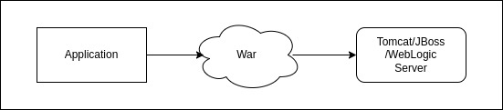
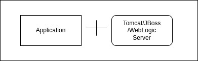
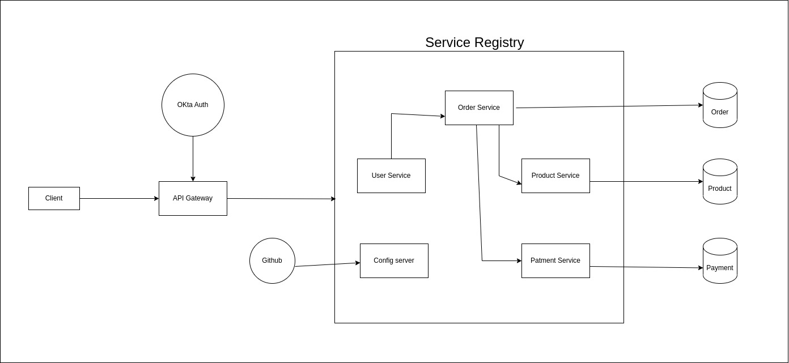

# Spring-Microservice-II

## How Spring works internally?
1. When we create a Springboot project, it has the spring factories added to the META-INF folder and all the configuration, all the jar files required are mentioned there. Whenever you add any properties or any configuration and it matches with the spring factories, it tries to add that configuration to it.
2. Based on the different dependency that you add the different configuration takes place inside.

*How normal web application runs*

*Springboot combines application and server in one jar file and run that jar file*

## How to change webserver?
1. Add exclude tomcat web server from springboot-starter-web dependency
```
<dependency>
    <groupId>org.springframework.boot</groupId>
    <artifactId>spring-boot-starter-web</artifactId>
    <exclusions>
        <exclusion>
            <groupId>org.springframework.boot</groupId>
            <artifactId>spring-boot-starter-tomcat</artifactId>
        <exclusion>
    </exclusions>
</dependency>
```
2. Add the dependency of the webserver that you want your application should run on.

## Springboot Actuator
- Allows us to monitor our springboot application.
- Whatever happens in our springboot application that can be handle using actuator
- Add the actuator dependency to perform this operation.

## Microservice Architecture Built in this project


## Config server
- helps manage and centralize configuration settings for multiple microservices
- **Centralized Configuration Management:** In a microservices architecture, you may have numerous microservices that require various configuration settings such as database connection strings, API keys, feature toggles, and more. Managing these configurations individually in each microservice can be cumbersome and error-prone. A Config Server centralizes these configurations in one place, making it easier to manage and update them.

- **Dynamic Configuration Updates:** Config Servers are capable of providing dynamic configuration updates to microservices without requiring them to be restarted. This means you can change configuration settings in real-time without interrupting the services, which is essential for maintaining high availability.

- **Environment-Specific Configurations:** With a Config Server, you can store configurations for different environments (e.g., development, testing, production) and ensure that each microservice uses the appropriate configuration for its environment. This simplifies the deployment process and reduces the risk of configuration errors.

- **Versioned Configurations:** Config Servers often support versioning of configuration settings. This means you can track changes to configurations over time, making it easier to understand what changed and when. It also allows you to roll back to previous configurations if needed.

- **Security:** Config Servers can provide security features such as encryption and access control, ensuring that sensitive configuration data is protected. Access to configurations can be restricted based on roles and permissions.

- **Integration with Spring Cloud:** Spring Boot's Config Server is part of the Spring Cloud ecosystem, which provides a set of tools and libraries for building microservices-based applications. It seamlessly integrates with other Spring Cloud components, such as Eureka (Service Discovery) and Ribbon (Load Balancing), to create a robust microservices architecture.

- **Simplifies Microservices Deployment:** When deploying microservices, you don't need to redeploy each service when configuration changes are made. Instead, the microservices fetch updated configurations from the Config Server when needed. This simplifies deployment and reduces downtime.

- **Consistency and Standardization:** Centralized configuration management promotes consistency and standardization across microservices. It ensures that all services adhere to the same set of configuration principles and best practices.

## Feign Client
- Feign is a declarative web service client developed by Netflix as part of the Spring Cloud ecosystem. It simplifies the process of making HTTP requests to RESTful web services by allowing you to write HTTP clients in a more concise and expressive manner. Feign is particularly useful in microservices architectures where one microservice needs to communicate with another over HTTP.

## Questions/Doubts
1. How spring works internally?
2. How springboot application runs?
3. How annotations play and important role in springboot application?
4. What are embedded server?
5. what is Springboot Actuator?
6. What is Springboot devtools?
7. 
